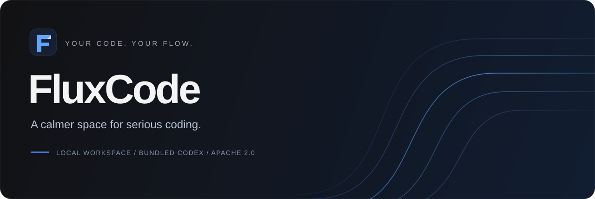
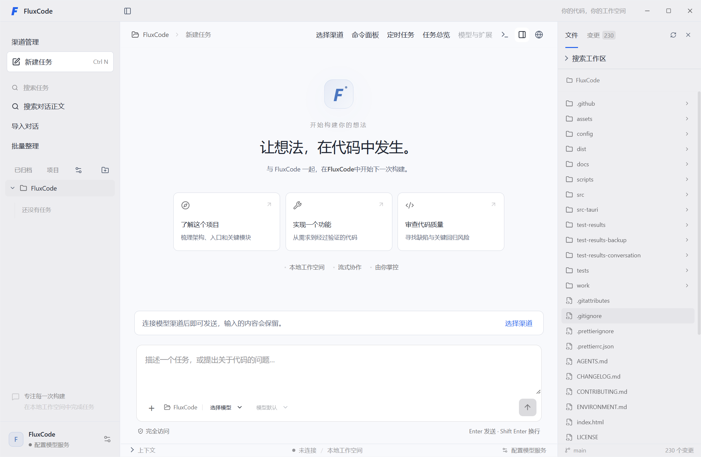

<p align="center">
  
</p>

<p align="center"><strong>让编码保持连贯，让工具退到身后。</strong></p>
<p align="center">基于内置 Codex 的本地编码工作空间。项目、对话、变更与终端，在同一个桌面里自然衔接。</p>

<p align="center">
  <a href="LICENSE"></a>
  
  
  <a href="docs/VERIFICATION.md"></a>
</p>

<p align="center">
  <a href="#开始使用">开始使用</a> ·
  <a href="#为连续的工作而设计">使用体验</a> ·
  <a href="docs/ARCHITECTURE.md">架构</a> ·
  <a href="CONTRIBUTING.md">参与贡献</a> ·
  <a href="CHANGELOG.md">更新记录</a>
</p>

---

## 一个工作空间，一条顺畅的路径



<sub>真实 Windows 桌面截图：打开本地项目后的起始工作区。所有可见控件均来自实际应用，不是概念渲染。</sub>

## 为连续的工作而设计

| 你正在做的事         | FluxCode 如何配合                                               |
| :------------------- | :-------------------------------------------------------------- |
| 从一个任务切到另一个 | 每个会话记住自己的模型和推理强度，重新打开仍可恢复              |
| 开始新任务           | 沿用最近选择的模型，推理强度回到 **模型默认**                   |
| 调整推理投入         | 输入框旁直接选择；模型默认省略 `reasoning.effort`，不会关闭推理 |
| 遇到失败或需要停止   | 保留未发送成功的输入，呈现错误；运行中的任务可停止              |
| 长时间阅读和编辑指令 | 可调且记忆的字号、中文字体回退、正文与控件同步缩放              |
| 查看代码和执行结果   | 文件预览、Git 差异、工具调用与终端输出留在当前工作区            |

标题栏可打开独立工作区窗口；各窗口共享会话进度，分别保留项目选择、草稿和面板。默认主题直接跟随 Windows 原生系统主题。

本轮交付范围、回滚与暂缓验收见 [Windows 交付记录](docs/DELIVERY-2026-09-25.md)，安装包校验值见 [SHA-256](docs/RELEASE-CHECKSUMS.txt)。

流畅是一项贯穿产品的约束：上下文连续、反馈清楚、选择可预期。
这份 [交互准则](docs/PRODUCT-EXPERIENCE.md) 约束之后的每一项功能。

## 开始使用

当前源码版本为 **0.1.0，Windows x86_64**。
仓库提供源码和安装包构建流程；当前工作树的正式签名发行及干净系统验收尚未完成。

构建出的桌面安装包内置 Codex，使用者不必另外安装 Codex、Rust 或 Node.js。
Windows 需要 WebView2，安装程序使用 Tauri 标准检查流程。

1. 启动应用，在 **渠道管理** 中粘贴 Responses 服务地址与 API Key，导入模型并启用渠道。
2. 打开本地项目，在输入框描述任务。
3. 按需选择模型与推理强度，发送后在工作区查看执行过程与变更。服务不提供模型目录时，可手动输入模型 ID。

侧栏「工作区管理」可搜索、重命名、关闭和重新打开项目。关闭不会删除历史、草稿或文件，已有终端继续运行；有任务运行时会提示先停止。创建 Git 工作树后可直接打开为独立工作区，并查看来源项目。顶部「任务总览」集中显示运行、等待输入、排队和失败状态，可跳转或停止指定任务。

API Key 可保存到系统凭据库，也可通过指定环境变量提供。
默认使用系统网络设置；需要代理时，可在渠道高级连接设置中填写。
终端与 Agent 默认 **完全访问，无逐次审批**，请使用可信项目和服务。
Git 功能需要本机 Git；项目自身的编译器和运行时仍由项目提供。

### 自己掌控配置

- **TOML 热重载**：连接、终端、代理、语言、主题与界面配置；保留注释，校验失败时继续使用有效设置，重连等待任务与终端空闲。
- **AGENTS.md**：留给用户自定义，应用不会覆盖。
- **ENVIRONMENT.md**：单独描述宿主环境，不占用用户提示词文件。
- **独立执行环境**：应用使用自己的引擎状态目录，不修改全局 Codex 配置。

应用配置位于可执行文件旁的 `data/fluxcode.toml`；对话、任务索引、草稿和备份也存放在同一 `data` 目录。API Key 存放在 Windows 凭据库，不写入备份。移动程序时请连同 `data` 目录一起移动；安装、升级和卸载的数据保留行为仍需在干净 Windows 环境验收。
已验证大小写变化和 289 字符中文路径下移动后恢复历史、继续对话。长路径依赖磁盘提供 Windows 短路径别名；不支持时会提示移动至较短路径，不把数据迁出程序目录。
参见 [配置与渠道](docs/configuration.md)、[配置模板](config/fluxcode.example.toml) 与 [引擎兼容说明](docs/ENGINE-COMPATIBILITY.md)。

## 构建桌面应用

| 层                          | 固定版本 / 职责                                      |
| :-------------------------- | :--------------------------------------------------- |
| Rust 1.98.1 + Tauri 2       | 进程生命周期、系统凭据、文件、配置与 IPC 边界        |
| React 19.3 + TypeScript 7   | 会话交互、流式展示、文件和终端面板                   |
| Node 24.13.1 + pnpm 10.23.0 | 前端构建与验证                                       |
| Codex 0.156.1               | 内置执行引擎，通过 app-server 协议集成，SHA-256 固定 |

Windows 开发机需安装 Rust/MSVC、Visual Studio C++ Build Tools、Windows SDK、Node 和 pnpm。
项目提供 Rust 版本文件及依赖锁文件。

```powershell
pnpm install --frozen-lockfile
./scripts/prepare-engine.ps1
./scripts/dev.ps1 dev
```

构建安装包：`./scripts/dev.ps1 build`。
直接在项目内构建并启动桌面程序：`pnpm desktop:run`，无需安装。已有构建可用 `pnpm desktop:run -NoBuild` 启动；开发期热更新仍用 `./scripts/dev.ps1 dev`。
开发版数据位于 `src-tauri/target/debug/data/`，与安装版隔离，单实例标识也独立，不会把启动请求转交给安装版。
输出目录：`src-tauri/target/release/bundle/nsis/`。
浏览器开发页仅用于 UI 开发，本地文件与执行能力由桌面宿主提供。

### 工程质量

领域测试、Rust 边界测试、浏览器工作流测试，以及真实内置引擎和原生桌面集成测试
共同覆盖核心路径。引擎测试使用本地 Responses 服务，不需要生产凭据。

参见 [验证记录](docs/VERIFICATION.md)、[贡献指南](CONTRIBUTING.md)、
[发布流程](docs/RELEASE.md) 和 [安全说明](SECURITY.md)。
CI 工作流在 GitHub 托管 Windows runner 上执行，使用 runner 自身网络；开发者可自行在本机环境配置代理。

## 当前边界

当前桌面验收以 Responses 协议与 Windows x64 为主。提供有超时和输出上限的命令面板、
交互式 PTY，以及带冲突检测的文件编辑。网页和 Markdown 链接在右侧 WebView2 面板打开，支持拖动调宽、地址栏、前进后退、刷新和一键转到系统默认浏览器。远程页面无权调用本地文件、终端和应用命令。
各模型支持的推理强度由服务决定，界面不会静默替换你的选择。

目前只交付 Windows 本地工具。软件更新仅保留禁用占位，不会检查、下载或安装更新；
模型请求仍使用你配置的服务，工具按需联网。macOS/Linux 安装包与正式代码签名尚未提供。
已完成一个真实 Responses 服务的有限接口与工具闭环验收；干净机器的安装/升级/卸载验收仍待完成。
Linux 容器中的执行引擎已测试，但 Linux 桌面及安装包尚未验收，且仍有依赖安全待办。
这些边界不隐藏在展示图里；详细状态以验证记录为准。

## 开源与致谢

FluxCode 采用 **Apache-2.0**，参见 [LICENSE](LICENSE) 与 [NOTICE](NOTICE)。
内置 [OpenAI Codex](https://github.com/openai/codex) 原样分发，保留其许可证和声明；
依赖许可与必要源码随安装包附带。开源许可不授予模型服务或商标权。

FluxCode 是独立项目，与 OpenAI 无隶属或背书关系。

<p align="center"><sub>Your code. Your flow.</sub></p>
