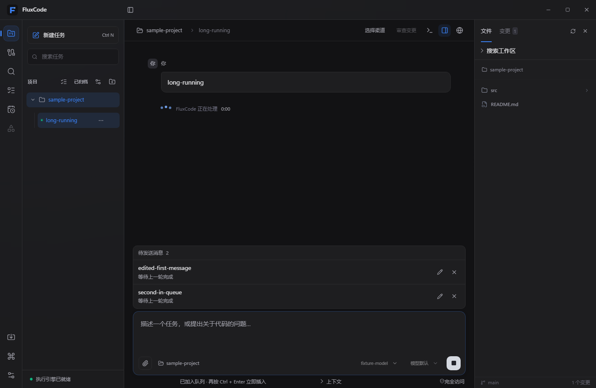
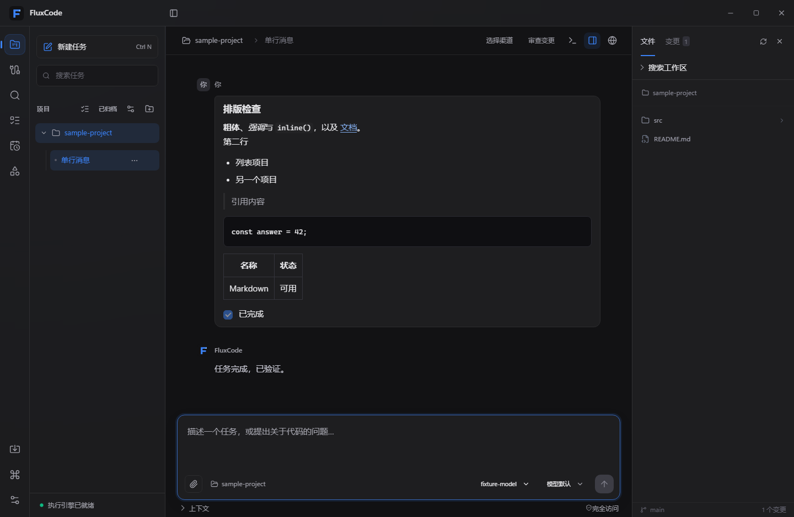

# FluxCode 0.1.5 — 输入队列与可见浏览器工具

日期：2026-10-04。适用：Windows。复用现有 Codex 0.157.0 引擎二进制。

- 任务运行时取消常驻的“排队发送”和“立即补充”按钮，仅保留停止。
- Ctrl + Enter 第一次把当前输入及附件加入队列；输入框保持为空时，再按一次将刚才那条消息立即插入当前轮次。普通 Enter 的发送／排队及 Shift + Enter 换行保持可用。
- 新输入、切换任务或当前轮次结束后，不再把上次的队列消息作为快捷键目标。长按和连续按键不会重复插入。
- 插入操作先持久化暂停状态，阻止队列同时自动发送；失败保留内容并提示用户检查当前任务后重试，不自动重放。
- 模型和推理强度一起靠右，窄窗口允许工具栏换行；主窗口和独立项目窗口采用相同契约。
- 运行中的三个点错峰跳动，旁边显示等待计时。遵循系统减少动画偏好，关闭动画时仍更新计时；计时表示当前界面的等待时间，不代表模型进度或网络健康度。

- 已发送消息气泡移除末段多余的 12px 下边距，单行上下留白对称；沿用 react-markdown 和 remark-gfm，修复列表、引用、代码、表格的块间距，普通文本段落保留用户换行。

- 待发送队列紧贴输入框，支持原地编辑、保存、取消编辑和取消排队。编辑期间暂停发送，保留顺序和附件；任务已停止时保存后保持暂停，避免意外发出。
- 智能体通过正式 MCP 工具使用内置浏览器，自动展开主窗口右侧面板并显示“智能体浏览”。打开、读取页面、前进、后退、刷新和关闭操作使用同一个可见网页。读取返回实际地址、标题、正文和链接；目前不支持点击、表单填写或任意脚本。
- 浏览器工具使用应用自带的辅助进程与 Windows 命名管道，无需额外安装。新建和恢复会话都会获得工具说明。

新增官方 Rust MCP SDK rmcp 3.2.0，依赖和上游许可证已纳入随包法律声明。没有数据库或用户配置格式迁移。浏览器工具本轮仅面向 Windows；数字签名等先前暂缓的环境验收不在本轮范围内。

验证记录见 [VERIFICATION.md](../VERIFICATION.md)。
